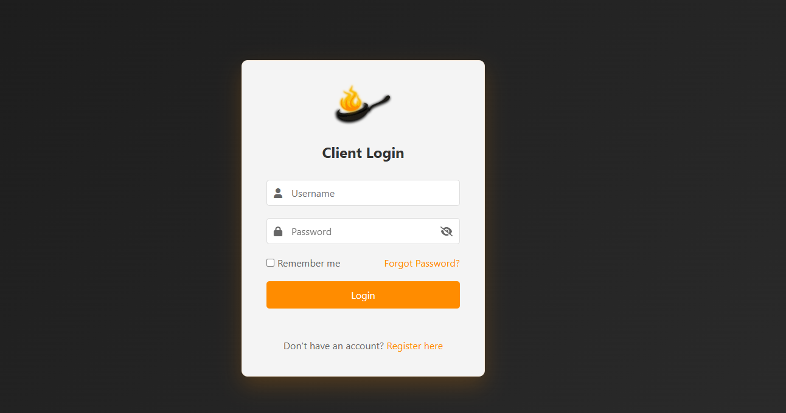

# Simple Client Login Form

A clean and modern client login interface with client-side authentication and a floating logo animation.



## Features

- Modern and responsive design
- Client-side authentication
- Animated floating logo
- Password visibility toggle
- Remember me functionality
- Error message display
- Mobile-friendly layout

## Files Structure

```
├── index.html           # Main login page
├── login-success.html   # Success page after login
├── style.css           # Stylesheet
├── script.js          # JavaScript functionality
└── logo.png           # Logo image
```

## Setup Instructions

1. Clone or download this repository
2. Place your logo image in the root directory as `logo.png`
3. Open `index.html` in a web browser

## Default Login Credentials

- Username: `admin`
- Password: `password123`

## Styling

The interface uses a dark theme with orange accents, inspired by a frying pan with fire. Colors used:
- Primary: `#ff8c00` (Dark Orange)
- Secondary: `#ff4500` (Orange Red)
- Background: Dark gradient
- Text: White/Gray shades

## Features Details

### Logo Animation
- Gentle floating animation
- 3-second duration
- 10px vertical movement
- Smooth ease-in-out timing

### Security Features
- Password visibility toggle
- Basic form validation
- Error messages for invalid credentials
- Remember me functionality using localStorage

### Responsive Design
- Works on all screen sizes
- Mobile-friendly interface
- Flexible layout adaptation

## Browser Compatibility

- Chrome (latest)
- Firefox (latest)
- Safari (latest)
- Edge (latest)

## Important Notes

This is a front-end only implementation. In a production environment, you should:
- Implement proper server-side authentication
- Use HTTPS for secure data transmission
- Hash passwords
- Implement proper session management
- Add CSRF protection
- Use proper security headers

## Customization

### Changing Login Credentials
Edit the `validCredentials` object in `script.js`:
```javascript
const validCredentials = {
    username: 'your-username',
    password: 'your-password'
};
```

### Modifying Animation
Adjust the floating animation in `style.css`:
```css
.logo {
    animation: float 3s ease-in-out infinite;
}

@keyframes float {
    0% { transform: translateY(0px); }
    50% { transform: translateY(-10px); }
    100% { transform: translateY(0px); }
}
```

## License

This project is open source 